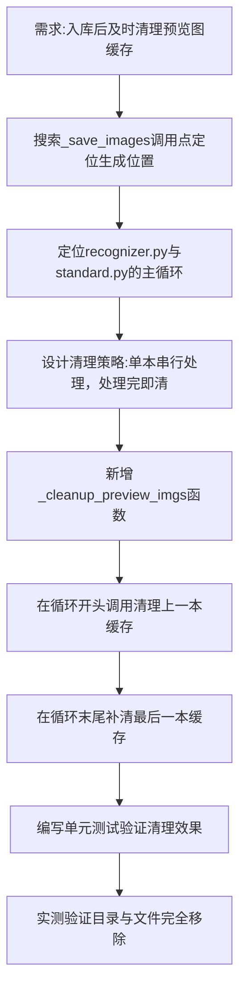

## 任务描述
优化书籍分类程序，实现"每处理完一本书即清理其预览图缓存"的逻辑，防止数百本书处理后产生数GB的无用中间数据。

## 执行过程

## 任务总结
成功在 recognizer.py 和 standard.py 中集成 _cleanup_preview_imgs 函数。逻辑为：每本书识别期间保留图片供AI查看，进入下一本书前清空上一本的 state/preview_imgs 目录及 std_prev_p*.png 文件。经测试，该机制确保任意时刻磁盘仅保留当前一本的图片（几MB），彻底解决批量处理时的存储堆积问题。
