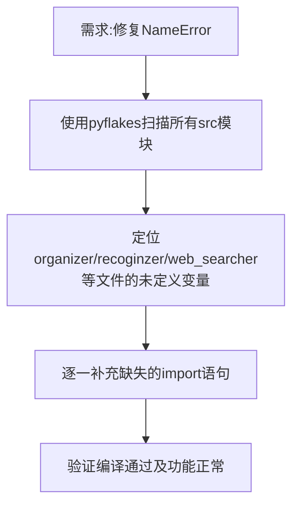

## 任务描述
排查并修复项目中多个模块因缺少 `import` 语句导致的 `NameError`（潜伏Bug）。

## 执行过程

## 任务总结
修复了以下文件的导入缺失问题：
- `organizer.py`: 补全 `domain_root`
- `recognizer.py`: 补全 `classify_log`
- `web_searcher.py`: 补全 `re`
- `library_db.py`: 补全 `json`
- `opds.py`: 补全 `json` 并修复函数签名
此类问题通常表现为‘第一次执行某功能时崩溃’，建议在新功能上线前进行全量静态检查。
