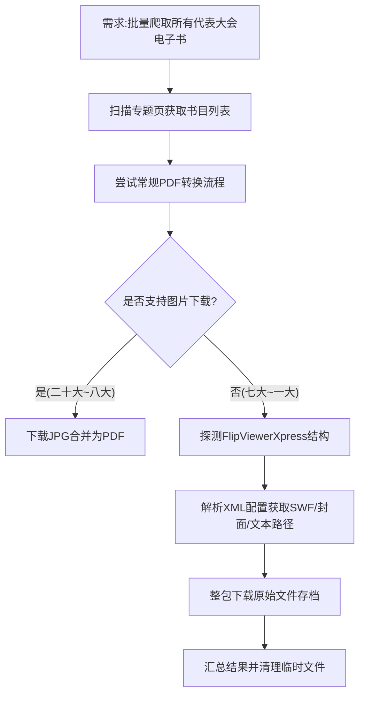

## 任务描述
批量爬取 theorychina.org.cn 下所有代表大会专题的电子书，覆盖二十大至一大共151本。针对部分早期书籍（Flash翻页系统）无法直接转PDF的情况，实现整包下载。

## 执行过程

## 任务总结
成功完成151本电子书的下载：
1. **常规书籍（132本）**：通过 `files/mobile/N.jpg` 模板下载图片并合并为PDF，自动写入元数据。
2. **Flash老书（19本）**：识别出 FlipViewerXpress 系统，通过解析 XML 配置文件定位 SWF 动画、封面图及 OCR 文本文件，采用整包下载方式保存原始资源。
3. **输出结构**：按专题分类，每本书独立文件夹，失败率为0。
