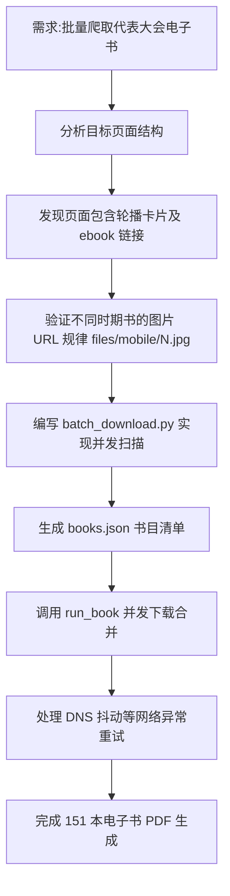

## 任务描述
批量爬取 theorychina.org.cn 全部 20 个代表大会专题下的电子书（共 151 本），自动识别页码范围，下载图片并合并为 PDF。

## 执行过程

```mermaid
graph TD
    A[需求:批量爬取代表大会电子书] --> B[分析目标页面结构]
    B --> C[发现页面包含轮播卡片及 ebook 链接]
    C --> D[验证不同时期书的图片 URL 规律 files/mobile/N.jpg]
    D --> E[编写 batch_download.py 实现并发扫描]
    E --> F[生成 books.json 书目清单]
    F --> G[调用 run_book 并发下载合并]
    G --> H[处理 DNS 抖动等网络异常重试]
    H --> I[完成 151 本电子书 PDF 生成]
```

## 任务总结
成功爬取二十大至一大共 20 个专题、151 本电子书。实现了自动探测总页数（HEAD请求）、8线程并发下载、PyMuPDF无损合并。输出目录按“专题/书名”层级隔离，每本书独立文件夹。
