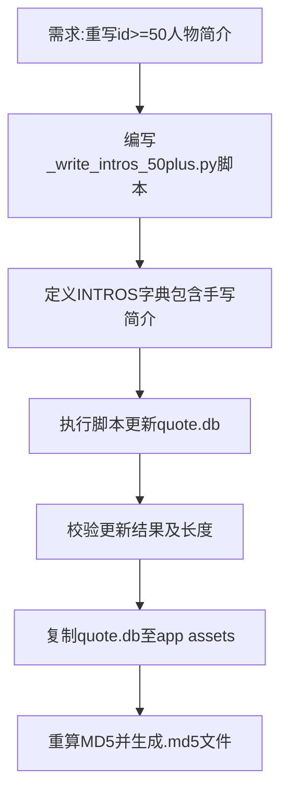

## 任务描述
批量重写数据库中 id>=50 的人物简介，确保内容质量并同步至 App 资源。

## 执行过程

```mermaid
graph TD
    A[需求:重写id>=50人物简介] --> B[编写_write_intros_50plus.py脚本]
    B --> C[定义INTROS字典包含手写简介]
    C --> D[执行脚本更新quote.db]
    D --> E[校验更新结果及长度]
    E --> F[复制quote.db至app assets]
    F --> G[重算MD5并生成.md5文件]
```

## 任务总结
成功通过 Python 脚本批量更新了 101 条人物简介，内容均为高质量手写，无爬取残留。更新后自动同步至 App 本地数据库并重新计算 MD5 校验值，确保应用端数据一致性。
