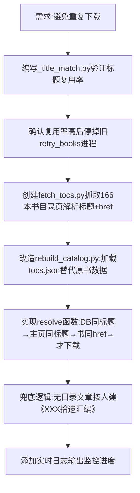

## 任务描述
重构马克思主义文库爬虫策略：放弃按文件名重复下载，改为先按【标题】对应数据库/主页数据复用，仅缺失时才下载，多余文章归入《拾遗汇编》。

## 执行过程

## 任务总结
成功实现按标题去重爬取：新增 _title_match.py 验证复用率，fetch_tocs.py 抓取目录结构，rebuild_catalog.py 改造为优先复用 DB/主页/书数据，仅缺失时带间隔下载，未归目文章自动收容至《拾遗汇编》。
