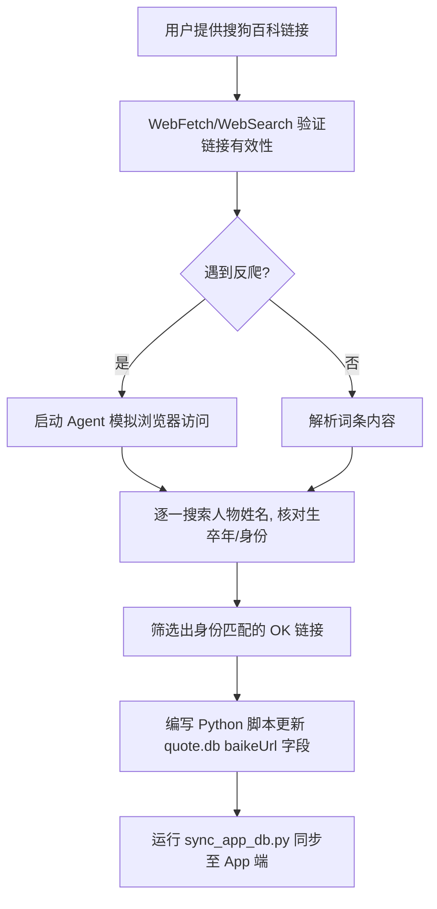

## 任务描述
为数据库中的人物补充搜狗百科链接，包括验证用户提供的链接及批量排查无链接人物。

## 执行过程

```mermaid
graph TD
    A[用户提供搜狗百科链接] --> B[WebFetch/WebSearch 验证链接有效性]
    B --> C{遇到反爬?}
    C -->|是| D[启动 Agent 模拟浏览器访问]
    C -->|否| E[解析词条内容]
    D --> F[逐一搜索人物姓名, 核对生卒年/身份]
    E --> F
    F --> G[筛选出身份匹配的 OK 链接]
    G --> H[编写 Python 脚本更新 quote.db baikeUrl 字段]
    H --> I[运行 sync_app_db.py 同步至 App 端]
```

## 任务总结
成功验证并入库 6 个搜狗百科链接（含施略普尼科夫等），解决了搜狗反爬问题，确保链接对应真实人物身份，并完成数据同步。
