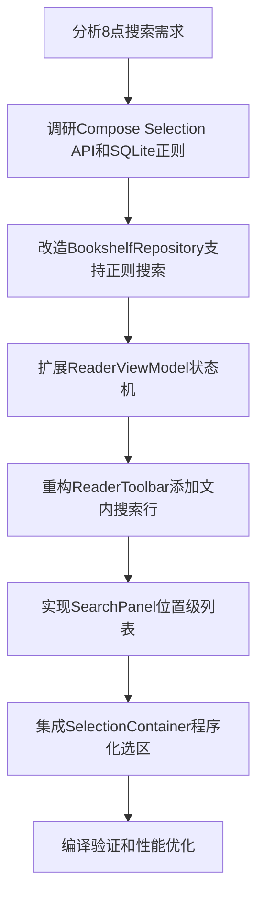

## 任务描述
实现搜索系统的多项改进：书内/文内搜索拆分、正则支持、选区高亮区分、语录自动选中等功能。

## 执行过程

```mermaid
graph TD
    A[分析8点搜索需求] --> B[调研Compose Selection API和SQLite正则]
    B --> C[改造BookshelfRepository支持正则搜索]
    C --> D[扩展ReaderViewModel状态机]
    D --> E[重构ReaderToolbar添加文内搜索行]
    E --> F[实现SearchPanel位置级列表]
    F --> G[集成SelectionContainer程序化选区]
    G --> H[编译验证和性能优化]
```

## 任务总结
完成搜索系统重构：支持全文/书内/文内三级搜索，引入正则匹配，实现搜索高亮与选区高亮颜色区分，语录入口自动选中段落，文内搜索提供上下翻页导航。
