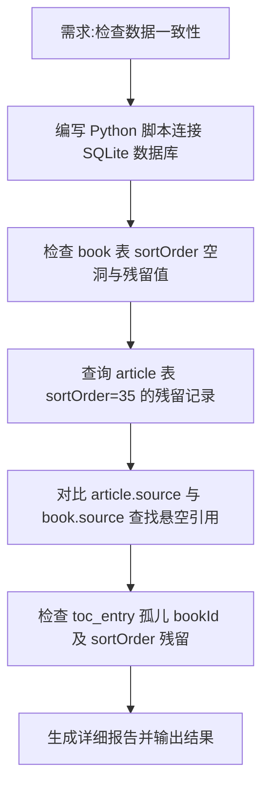

## 任务描述
在修改书籍排序 (book.sortOrder) 后，全面检查文章表 (article) 和目录表 (toc_entry) 是否残留旧排序值 (如 35)、存在孤儿引用或 source 不匹配问题。

## 执行过程

## 任务总结
通过自定义 Python 脚本全库扫描，验证了 book 表修改后，article 表和 toc_entry 表无 sortOrder=35 残留，无孤儿 bookId，且所有 article.source 均能在 book 表中找到对应项，确保数据完整性。
