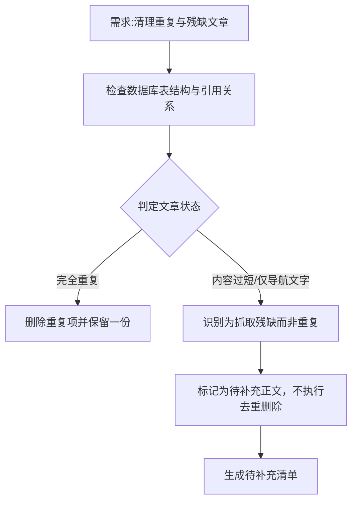

## 任务描述
清理数据库中同书内的完全重复文章及空/残缺文章，并记录待补充。

## 执行过程

## 任务总结
成功实现清理逻辑修正：
1. **去重策略**：仅针对同书内完全重复的文章进行删除。
2. **残缺处理**：严格区分“内容重复”与“抓取残缺”。对于仅有「上一篇/回目录/下一篇」等导航文字的文章（如曼德尔多本书中的特定ID段），视为正文缺失的残缺数据，**不进行去重删除**，而是单独记录到待补充清单，后续需补充正文。
3. **执行方式**：避免先扫描确认再执行的冗余流程，直接按上述逻辑执行清理与记录。
