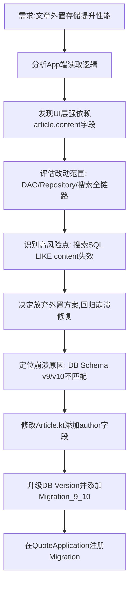

## 任务描述
尝试将文章正文外置为 md/txt 文件以提升性能，后评估复杂度放弃，转回修复 App 崩溃问题。

## 执行过程

## 任务总结
1. **架构决策**：放弃文章外置方案，因涉及搜索逻辑重构（原SQL依赖content列）及大量代码改动，风险过高。
2. **崩溃修复**：通过添加 `author` 字段、升级 Room 数据库版本至 v10 并注册 `MIGRATION_9_10` 解决 Schema 不匹配导致的重建崩溃问题。
