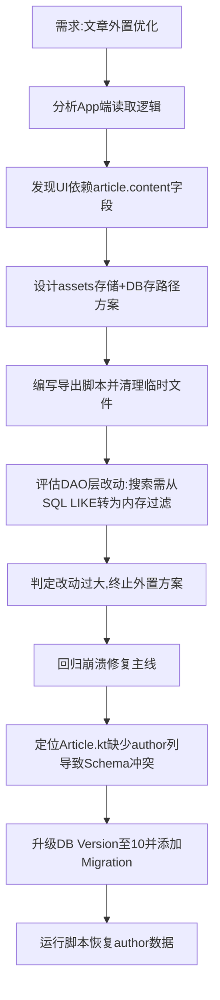

## 任务描述
尝试将文章正文外置为 md/txt 文件以优化 App 性能，后因改动复杂度高（涉及 DAO 层重构、搜索逻辑变更）而放弃，转而修复因 Schema 不匹配导致的崩溃问题。

## 执行过程

## 任务总结
1. **外置方案终止**：因搜索功能（BookshelfRepository）强依赖 SQL `LIKE content`，外置后需全量加载或重写搜索索引，成本过高。
2. **崩溃修复完成**：在 Article.kt 补充 author 字段，AppDatabase 版本升至 v10，注册 Migration_9_10 自动建表，并恢复 151 条作者标注数据。
