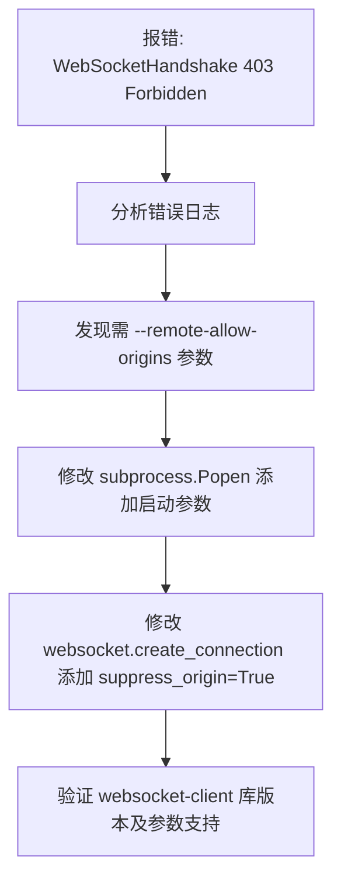

## 任务描述
解决新版 Edge/Chrome 浏览器调试端口 WebSocket 连接返回 403 Forbidden 错误。

## 执行过程

## 任务总结
通过双保险方式修复了新版浏览器的 Origin 校验拦截：
1. 启动浏览器时增加 `--remote-allow-origins=*` 参数；
2. 建立 WebSocket 连接时设置 `suppress_origin=True` 以抑制 Origin 头发送。
