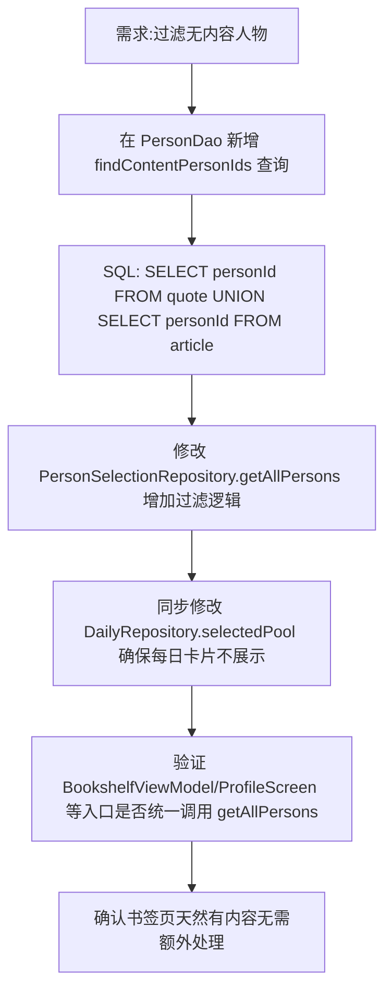

## 任务描述
实现「无内容人物视为预备役」的过滤机制：在人物选择列表、默认选中状态及书架展示中，自动排除没有语录、诗歌或文章的预备役人物。

## 执行过程

## 任务总结
成功实施预备役过滤：在 DAO 层通过 UNION 查询获取有内容人物 ID 集合，在 Repository 层统一过滤掉 styleKey 为编者且不在内容 ID 集合中的人物。该逻辑已覆盖人物选择页、书架页、我的页统计及每日推荐卡片，确保无内容人物仅存在于数据库中而不参与任何前端展示与交互。
