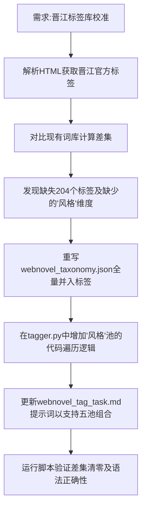

## 任务描述
根据晋江官方279个标签进行词库校准，补齐缺失标签，并将词库升级为"题材/情节/角色/衍生/风格"五池结构，同步更新打标程序。

## 执行过程

## 任务总结
成功完成词库v4.0升级：
1. **数据层**：`webnovel_taxonomy.json` 新增204个晋江标签，新增"风格"池（含甜文/沙雕/正剧等），总词数541，零重复。
2. **代码层**：`tagger.py` 扩展了标签池遍历范围至5个维度；`webnovel_tag_task.md` 提示词更新为五池自由组合规则。
3. **结果**：实现了从外部数据源到内部结构化配置的自动化同步与代码适配。
