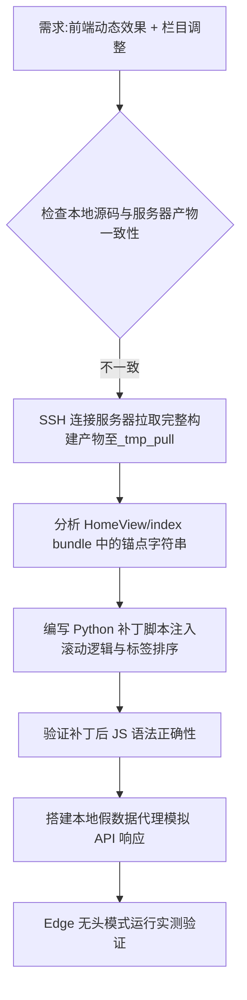

## 任务描述
针对前端项目本地源码与服务器构建产物不一致的情况，实现‘在库册数’滚动计数器效果及‘党政学习’栏目置顶。

## 执行过程

## 任务总结
成功解决本地源码滞后问题：通过 SSH 拉取服务器最新产物，利用 Python 脚本精准替换 JS 锚点注入滚动计数逻辑（easeOut 缓动 + setInterval 轮询），并通过本地代理模拟数据流完成功能验证。关键步骤包括：锚点定位、补丁生成、语法校验、假数据环境搭建。
