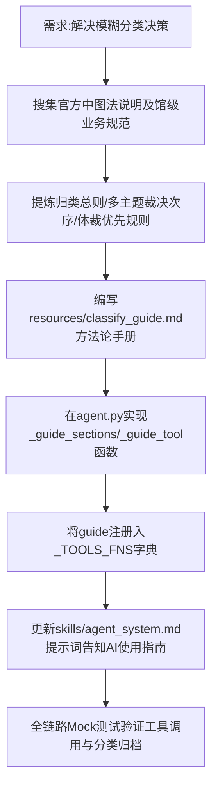

## 任务描述
为解决图书分类中哲学/宗教/文学等边界模糊导致的决策困难，构建本地《分类决断指南》并集成至Agent工具链，使AI在两可时能按需检索裁决规则。

## 执行过程

## 任务总结
成功创建包含16节方法论的分类决断指南，实现了支持关键词检索和目录浏览的`guide`工具，并将其无缝集成到Agent系统中。测试表明AI可在遇到两可问题时通过`guide`获取裁决依据，显著提升了分类准确率。
