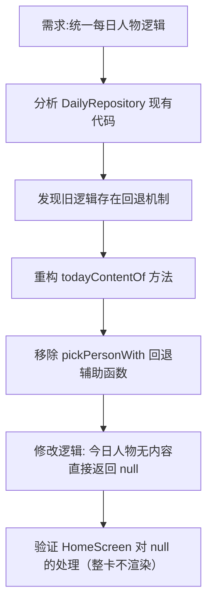

## 任务描述
修正每日内容推荐逻辑，严格执行「先确定性随机一位人物，再仅从该人物名下取内容」的原则。若该人物没有某类内容（语录/诗词/文章），则该类卡片直接不显示，严禁回退到其他人物选取。

## 执行过程

## 任务总结
1. 重构 `DailyRepository.todayContentOf`，确保人物与内容强绑定。
2. 删除了允许跨人物回退的 `pickPersonWith` 逻辑。
3. 实现了当今日人物缺少特定类型内容时，对应卡片完全隐藏的行为。
