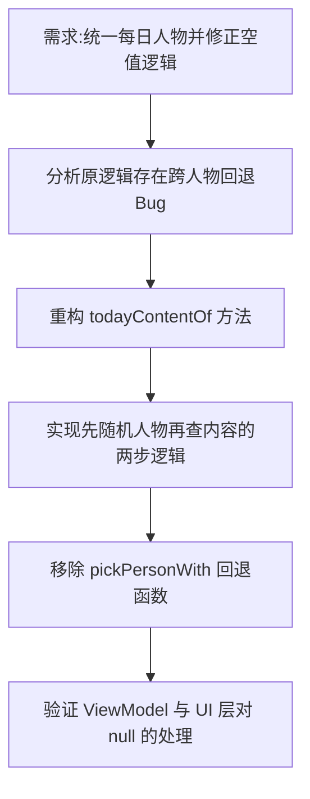

## 任务描述
修正 DailyRepository 每日内容选取逻辑，确保语录、诗词、文章来自同一位人物，且若该人物无某类内容则整卡不显示。

## 执行过程

## 任务总结
修复了每日卡片的人物不一致问题：
1. 逻辑改为：先确定性随机一位人物 -> 仅查询该人物的指定类型内容。
2. 若该人物无对应内容，直接返回 null，UI 层整卡隐藏，不再回退到其他人物。
3. 删除了废弃的 `pickPersonWith` 辅助方法，简化代码结构。
