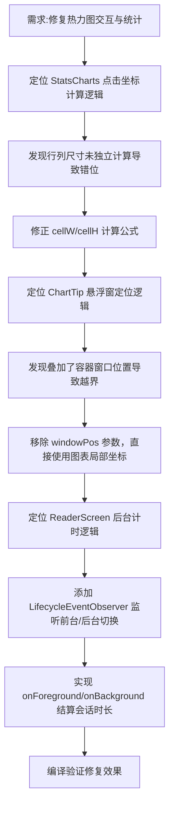

## 任务描述
修复阅读热力图点击识别不准、悬浮窗位置偏移以及后台时长统计不准确的问题。

## 执行过程

## 任务总结
修复三个关键 Bug：1. 热力图点击区域错位：修正行列宽高独立计算逻辑；2. 悬浮窗乱飞：移除错误的窗口位置叠加，改用相对父容器的局部坐标并收敛范围；3. 时长统计不准：在 ReaderScreen 中添加 LifecycleObserver，在应用切后台时自动结算会话时长，确保数据完整性。
