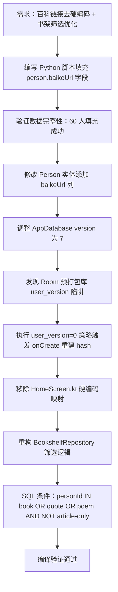

## 任务描述
将人物百科链接从代码硬编码迁移至数据库，并优化书架筛选逻辑：仅当人物拥有书籍、语录或诗词时，才在书架筛选栏中显示（仅有文章的人物不显示）。

## 执行过程

## 任务总结
成功将 60 位人物的百科链接存入数据库，移除代码硬编码。针对 Room 预打包数据库，采用 `user_version=0` 策略避免 schema hash 校验失败导致崩溃。书架筛选逻辑修正为：仅当人物存在书籍、语录或诗词记录时进入筛选栏，彻底过滤仅有文章的冗余人员。
