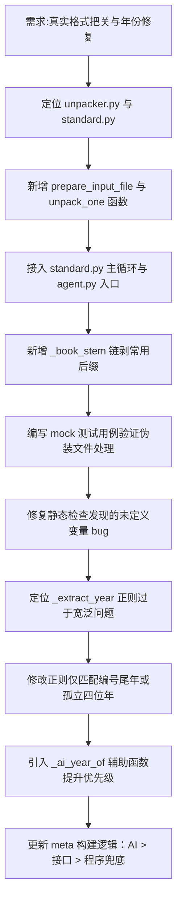

## 任务描述
1. 实现"按需真实格式把关"：在文件进入处理流程前，通过魔数识别真实类型，修复多层后缀（如 .rar.zip.pdf），当场解压真压缩包，确保归档使用正确后缀。
2. 修复年份提取 Bug：解决标准号中段数字（如 GB/T 19264.2）被误识别为发布年份的问题，确立"AI/官方数据优先，程序严格形兜底"的策略。

## 执行过程

## 任务总结
成功实现按需格式把关：`prepare_input_file` 在文件处理前验身，魔数识别真类型，修复多层后缀，真压缩包就地解压并备份原件；书名兜底改用 `_book_stem` 链剥常规后缀。修复年份提取 Bug：`_extract_year` 改为严格匹配 `-2013` 形式或孤立四位年，避免从标准号中段误取年份；元数据构建中年份优先级调整为 AI 输出 > 接口数据 > 文件名兜底。
