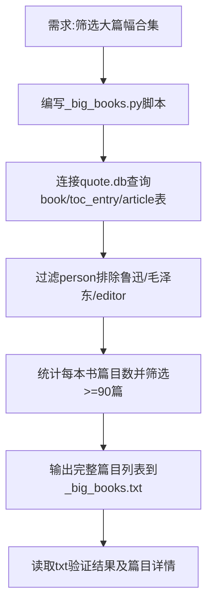

## 任务描述
根据新规则（仅对‘拾遗汇编’等非出版物进行拆分或改名）筛选并整理数据库中篇目数≥90的书籍清单。

## 执行过程

```mermaid
graph TD
    A[需求:筛选大篇幅合集] --> B[编写_big_books.py脚本]
    B --> C[连接quote.db查询book/toc_entry/article表]
    C --> D[过滤person排除鲁迅/毛泽东/editor]
    D --> E[统计每本书篇目数并筛选>=90篇]
    E --> F[输出完整篇目列表到_big_books.txt]
    F --> G[读取txt验证结果及篇目详情]
```

## 任务总结
成功生成包含15本目标书籍的清单，涵盖罗莎·卢森堡、托洛茨基等人的《拾遗汇编》等，为后续按规则拆分提供数据基础。
