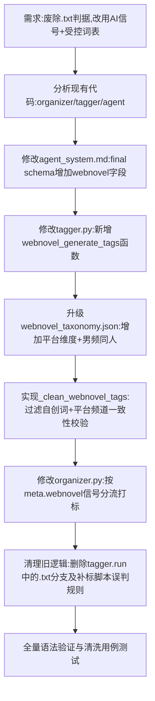

## 任务描述
重构网文打标逻辑：废除按 .txt 后缀猜网文的规则，改为由识别 AI 在 final 阶段输出 webnovel 信号；升级受控词表增加“首发平台”维度，并实现程序侧的标签清洗与一致性校验。

## 执行过程

## 任务总结
1. **判定前移**：识别 Agent 根据正文证据输出 `webnovel` 布尔值，不再依赖文件后缀。
2. **受控打标**：网文打标引入 `webnovel_generate_tags`，将频道、平台、大类、流派词表喂给 AI，程序侧通过 `_clean_webnovel_tags` 进行双保险过滤。
3. **词表升级**：`webnovel_taxonomy.json` v2.0 增加“首发平台”枚举（起点/晋江/飞卢等），男频大类增加“同人”。
4. **一致性校验**：清洗逻辑增加平台与频道的一致性检查（如女频+起点则丢弃平台标签），防止 AI 逻辑冲突。
5. **代码清理**：彻底移除 `organizer.py` 和 `tagger.py` 中基于 `.txt` 后缀的硬编码分支。
