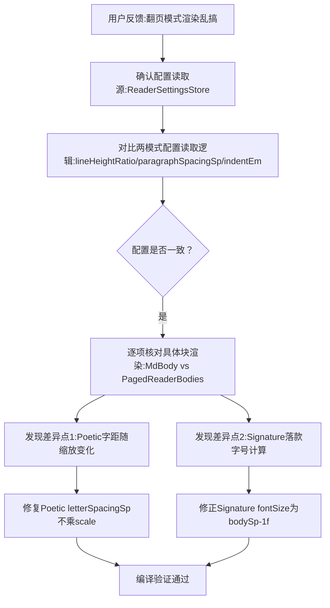

## 任务描述
排查并修复翻页模式与滚动模式在排版参数（行距/段距/缩进）及具体文本块（Quote/Signature/Poetic 等）渲染上的不一致问题。

## 执行过程

## 任务总结
确认两模式均正确读取 settings 配置。修复两处真实差异：1. Poetic 诗块字距不再随行宽缩放 (letterSpacingSp * scale -> letterSpacingSp)；2. Signature 落款字号统一为正文小一号 (bodySp - 1f)。期间曾误判落款字号方向，需警惕此类反向修改。
