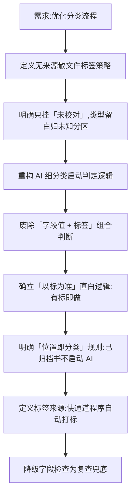

## 任务描述
优化“先发布后分类”自动化流程规划，解决无来源文件标签策略、AI 细分类启动判定逻辑及标签来源机制问题。

## 执行过程

## 任务总结
成功更新规划文档：1) 无来源散文件仅挂「未校对」，精修时补类型；2) 细分类启动完全依赖「待分类」标签，废除字段值判断，明确物理归档书籍直接登记路径不启动 AI；3) 标签由快通道程序按欠账自动打标，人工仅在例外时干预；4) 字段检查降为防漏标的兜底机制。
