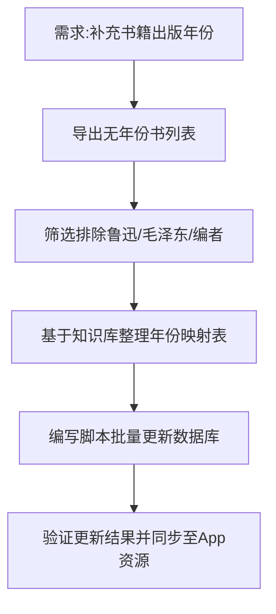

## 任务描述
为数据库中缺失出版年份的书籍（排除鲁迅、毛泽东及编者）补充出版年份。

## 执行过程

```mermaid
graph TD
    A[需求:补充书籍出版年份] --> B[导出无年份书列表]
    B --> C[筛选排除鲁迅/毛泽东/编者]
    C --> D[基于知识库整理年份映射表]
    D --> E[编写脚本批量更新数据库]
    E --> F[验证更新结果并同步至App资源]
```

## 任务总结
成功为656本无年份书籍中的部分重要著作补充了出版年份。规则：只要是真实出版物即可，不区分正式或非正式；排除鲁迅、毛泽东及编者作品。
