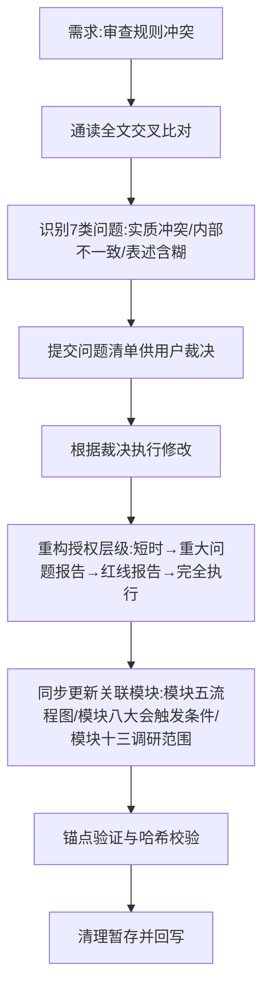

## 任务描述
审查并重构《革命性协作协议》规则，解决模块间的逻辑冲突，并将原有的三层授权体系升级为更精细的四层体系。

## 执行过程

## 任务总结
1. **重构授权体系**：新增第三层（红线问题报告授权）和第四层（完全执行），明确不同层级下的停报条件和自主权边界。
2. **解决冲突**：明确了模块十二（主观能动性）与模块十四（红线报告）的衔接，规定第三层红线立即停报，第四层红线统一汇报。
3. **细节修正**：模块五流程图增加“已错即转批评”分支；模块八统一汇报按大会记录；模块九强调“以实践为准”需遵守程度规则，避免盲动主义。
