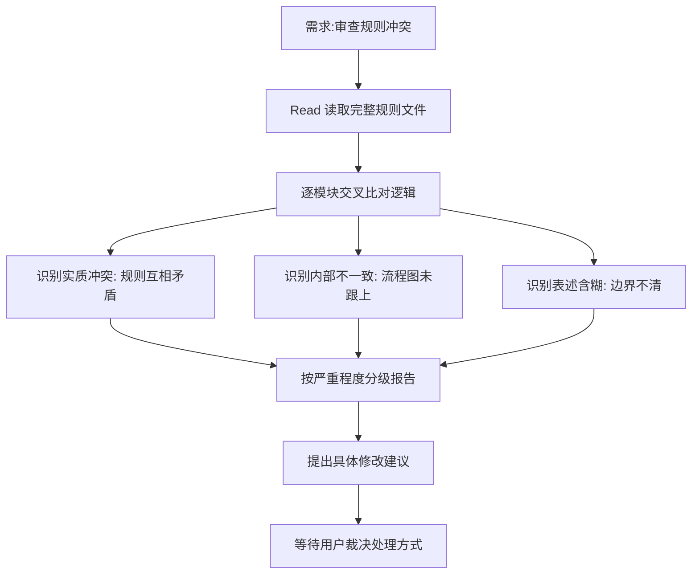

## 任务描述
通读并审查《革命性协作协议》，识别潜在的规则冲突、内部不一致及表述含糊之处。

## 执行过程

```mermaid
graph TD
    A[需求:审查规则冲突] --> B[Read 读取完整规则文件]
    B --> C[逐模块交叉比对逻辑]
    C --> D[识别实质冲突: 规则互相矛盾]
    C --> E[识别内部不一致: 流程图未跟上]
    C --> F[识别表述含糊: 边界不清]
    D --> G[按严重程度分级报告]
    E --> G
    F --> G
    G --> H[提出具体修改建议]
    H --> I[等待用户裁决处理方式]
```

## 任务总结
通过系统性审查发现了 7 个问题（3 实质冲突 + 2 内部不一致 + 2 表述含糊），并按严重程度分级报告。明确了不同层级问题的处理优先级，为后续规则优化提供了清晰的方向。
