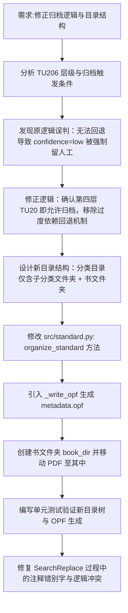

## 任务描述
修正规范图集归档逻辑：明确第四层（TU20）即满足归档条件，不应因路径钻取过深或无法回退而拒绝归档；重构目录结构，实现“融合又分开”，即分类目录下仅保留子分类文件夹和书文件夹，书的所有文件（PDF+metadata.opf+封面）聚合在书文件夹内。

## 执行过程

## 任务总结
成功修正归档逻辑：明确第四层即可归档，解决因无法回退导致的误拦截问题。完成目录结构重构：规范图集归档时，按年份归类后，将 PDF 与 metadata.opf 聚合在独立的“书文件夹”内（如 `.../2012/12J003 室外工程/`），确保浏览分类树时不被散落的 PDF 干扰，且元数据完整关联。
