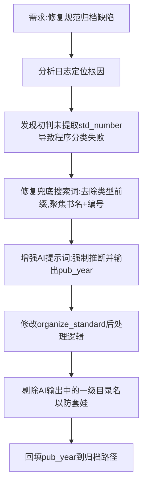

## 任务描述
修复规范图集归档中因标准号缺失导致的AI兜底搜索失败及目录套娃问题。

## 执行过程

## 任务总结
1. **搜索优化**：在 `standard.py` 中，兜底搜索不再使用“类型+书名”（易搜出百科垃圾），改为“书名+标准+编号”。
2. **结构化增强**：提示AI在兜底时必须输出 `pub_year`（从标准号如GB 55001-2021中提取），并写入 metadata。
3. **防套娃逻辑**：在后处理中，自动剔除 AI 输出 dirs 中与一级目录重复的元素（如“国家标准”），防止生成 `1 - 国家标准\国家标准` 这种冗余路径。
4. **年份回填**：归档路径动态插入 `pub_year` 层，解决“无年份”归类问题。
