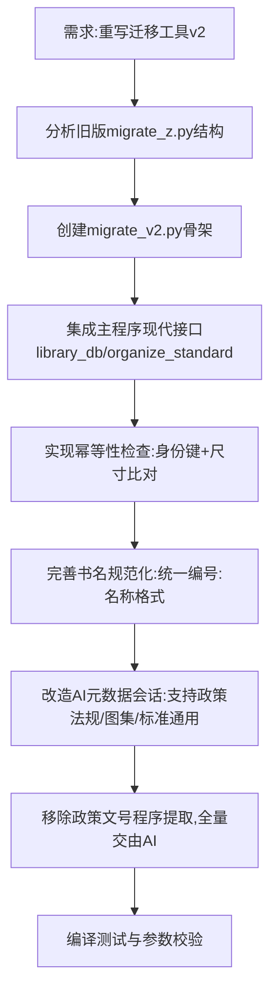

## 任务描述
基于旧版 migrate_z.py 重写规范图集迁移工具 v2，实现源目录参数化、幂等性检查、书名规范化及 AI 元数据补全。

## 执行过程

## 任务总结
成功创建 [guifan_migrate/migrate_v2.py](file:///f:/projects/shujguanl/guifan_migrate/migrate_v2.py)，实现了以下关键特性：
1. **幂等性**：通过 isbn 列存储身份键（编号+年份），同号同尺寸自动跳过，move 模式自动清理源文件。
2. **书名规范**：调用主程序 organize_standard 确保新书夹/OPF/封面与流水线一致。
3. **AI 增强**：政策文号不再依赖文件名正则，全部交由 AI 从红头/正文中查找；图集号解析失败时触发 AI 会话。
4. **参数化**：支持 --src 指定源目录，不再写死 Z 盘。
