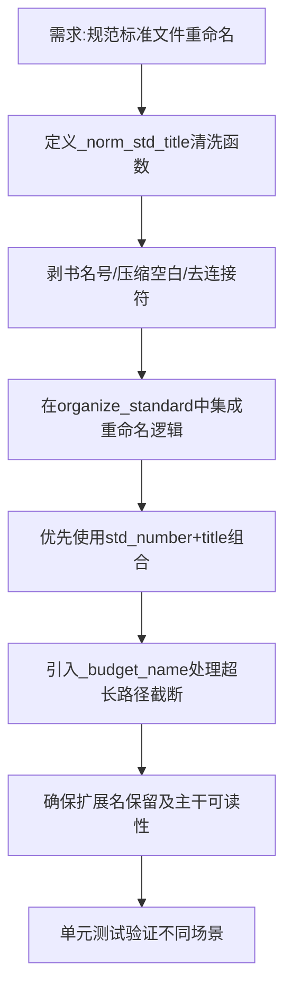

## 任务描述
为规范标准类文件实现自动化重命名功能，去除下载站垃圾前缀、书名号等非标准字符，统一格式为「标准号 标准名称」。

## 执行过程

## 任务总结
成功实现标准文件重命名：新增 `_norm_std_title` 清洗函数；归档时优先拼接 `std_number` 和 `title`；利用 `_budget_name` 跨平台预算机制截断超长文件名（单段≤47字，总长≤236字），确保书文件夹和文件名的规范性与兼容性。
