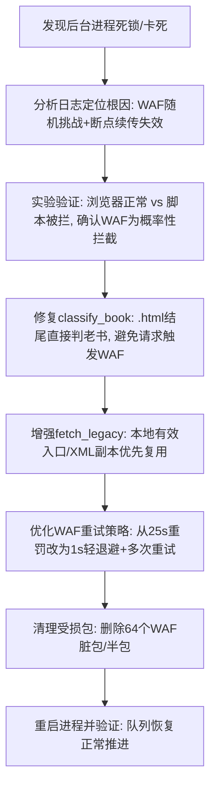

## 任务描述
恢复因华为云 WAF 风控拦截而停滞的电子书批量下载任务，修复断点续传逻辑并优化请求策略。

## 执行过程

## 任务总结
成功恢复下载队列。核心修复包括：1) 建立全局请求闸与WAF识别机制（检测HuaweiCloudWAF特征）；2) 修正断点续传判定逻辑（基于XML引用完整性99%阈值）；3) 优化WAF应对策略（秒级退避而非长时间惩罚）；4) 修复stdout双层包装导致的崩溃隐患。
