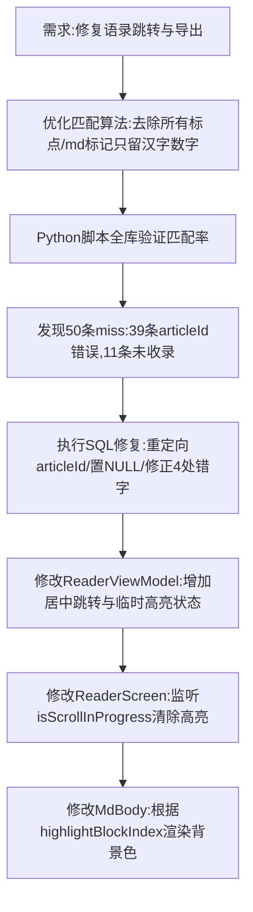

## 任务描述
修复语录跳转匹配不准及导出白边问题；实现从首页点击语录进入阅读页时，等待页面加载后跳转到对应行，并采用居中定位与临时高亮（用户交互即退出）。

## 执行过程

## 任务总结
1. 匹配算法升级：`normalizeForMatch` 彻底清洗非汉字字符，配合8字窗口投票机制，大幅降低误判。
2. 数据修复：修正了数据库中指向错误的文章ID及少量语录错字，确保跳转目标准确。
3. UI体验：跳转位置改为视口中部（50%），避免顶部定位导致的计算偏差超出屏幕；跳转后短暂高亮目标段落，用户拖动滚动即自动清除。
