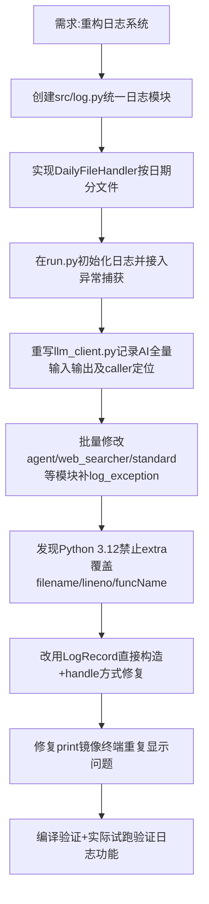

## 任务描述
重构项目日志系统，实现按日期自动分文件、AI输入输出全量记录、业务调用点精准定位（文件:行号:函数）、规范化异常traceback输出。

## 执行过程

## 任务总结
成功实现完整日志系统：
1. 日志按当前日期自动分文件存储于logs/目录
2. AI输入输出全量记录（DEBUG级只进文件），标注provider和业务调用点
3. 所有except块补充log_exception记录完整traceback
4. print语句镜像写入日志文件并带精准定位信息
5. 未捕获异常通过excepthook落盘
6. 修复了Python 3.12兼容性问题和终端重复输出问题
