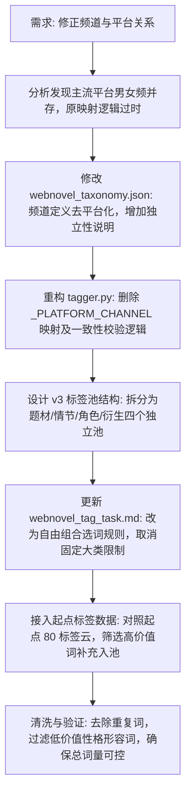

## 任务描述
重构网文标签分类体系，解决‘频道绑定平台’的逻辑缺陷，并基于番茄/起点等主流平台的标签库形态，建立‘大词池自由组合’的打标模式。

## 执行过程

## 任务总结
成功实现标签体系 v3.0 升级：
1. **逻辑解耦**：彻底移除代码中‘平台推断频道’的硬编码，确立‘平台与频道相互独立’原则。
2. **结构重塑**：废弃原有的‘大类+流派’层级，改为‘题材/情节/角色/衍生’四大标签池，支持 AI 自由组合（总量≤10）。
3. **词库扩充**：结合番茄大词库与起点细节标签，词库规模扩展至 325 词，覆盖修真流派、职业身份等高价值维度，且经过去重验证。
