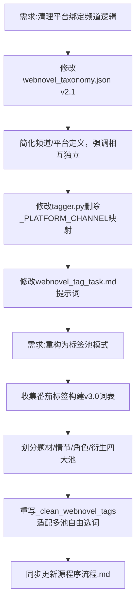

## 任务描述
重构网文标签体系：解耦平台与频道关系，并将结构化分类升级为类似番茄小说的“标签池”自由组合模式。

## 执行过程

## 任务总结
完成标签体系 v3.0 升级：
1. **解耦**：彻底移除平台与频道的强制映射，明确主流平台男女频并存，严禁互相推断。
2. **标签池**：废弃旧的大类/流派限制，建立 99个题材 + 94个情节 + 62个角色 + 22个衍生的词库。
3. **逻辑变更**：AI 从四池自由组合选 3~9 个标签（总量≤10），程序侧仅做白名单校验和去重。
4. **代码适配**：tagger.py 清洗逻辑改为遍历所有池子匹配，不再按固定顺序截断。
