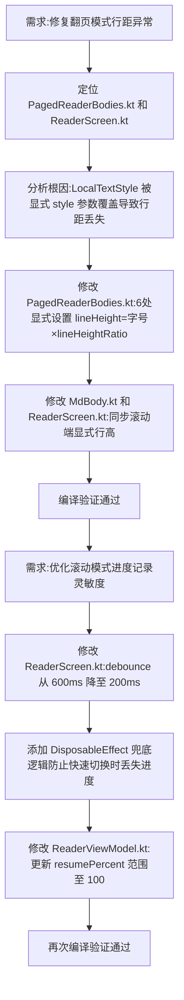

## 任务描述
修复 Android Compose 阅读器中翻页模式与滚动模式行距不一致问题，并优化滚动模式下的阅读进度记录机制。

## 执行过程

## 任务总结
成功解决翻页模式行距偏紧问题：识别出 Compose Text 显式传 style 会替换 LocalTextStyle 导致行距退化为自然行高的根因，在 PagedReaderBodies.kt 和 ReaderScreen.kt/MdBody.kt 中统一显式设置 lineHeight = fontSize * lineHeightRatio。同时优化进度记录：将 debounce 时间从 600ms 减至 200ms，并新增 DisposableEffect 兜底逻辑确保快速切换时也能记录最终位置，支持 100% 进度语义。
