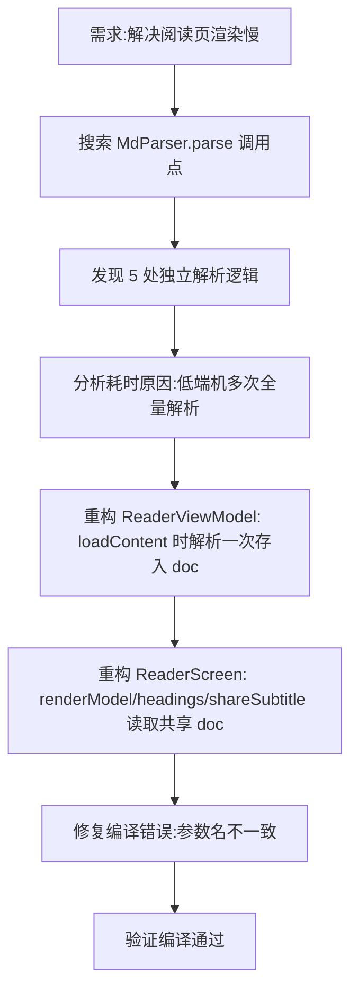

## 任务描述
解决阅读页打开文章时渲染卡顿问题（等待数秒）。排查发现同一篇文章在 UI 层被 CommonMark 全文解析了 5 次（渲染、标题索引、语录匹配、分享副标题等各自调用 MdParser.parse）。

## 执行过程

## 任务总结
成功将文章解析从 5 次减少到 1 次。在 `ReaderViewModel` 中新增 `doc: MdDoc?` 字段缓存解析结果，UI 层所有依赖 Markdown 结构的组件均改为读取该缓存，消除了冗余计算开销。
