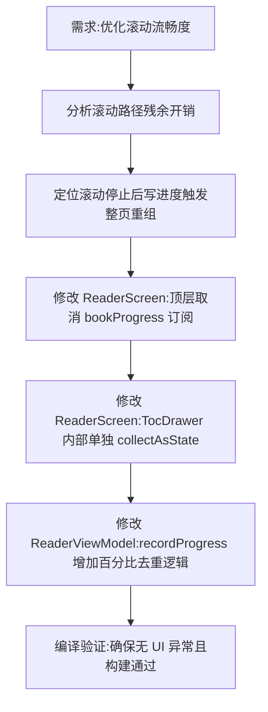

## 任务描述
优化阅读页滚动流畅度，消除滚动停止后的周期性卡顿，同时保持架构稳定不进行大规模重构。

## 执行过程

## 任务总结
成功解决滚动卡顿：1. 在 ReaderScreen 中将 bookProgress 订阅下沉至 TocDrawer 内部，避免整页重组；2. 在 ViewModel 的 recordProgress 中增加判断，仅当百分比变化时才更新 StateFlow，减少无效 UI 刷新。最终实现滚动过程中零重组，停止后仅更新抽屉目录。
