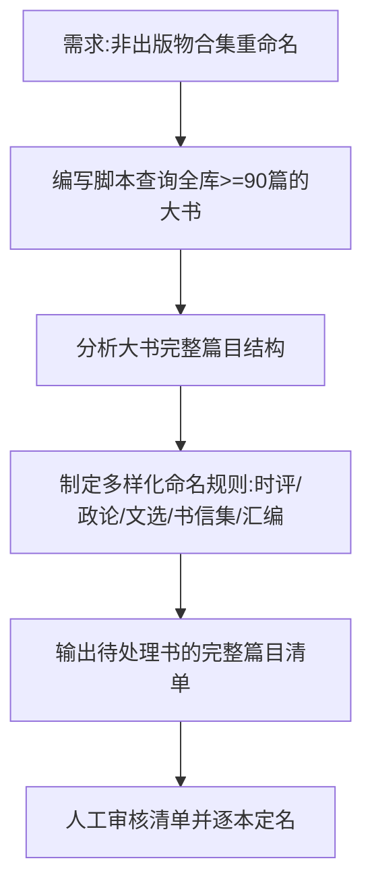

## 任务描述
对数据库中非出版物合集（如《拾遗汇编》、《未分段》等）进行批量重命名和拆分，解决命名单一问题。

## 执行过程

```mermaid
graph TD
    A[需求:非出版物合集重命名] --> B[编写脚本查询全库>=90篇的大书]
    B --> C[分析大书完整篇目结构]
    C --> D[制定多样化命名规则:时评/政论/文选/书信集/汇编]
    D --> E[输出待处理书的完整篇目清单]
    E --> F[人工审核清单并逐本定名]
```

## 任务总结
成功识别出罗莎·卢森堡、托洛茨基等多位作者的多个大合集。制定了基于内容性质的多样化命名策略，避免了千篇一律的“拾遗汇编”。输出了包含4000+行详细篇目的决策清单，为后续脚本执行提供依据。
