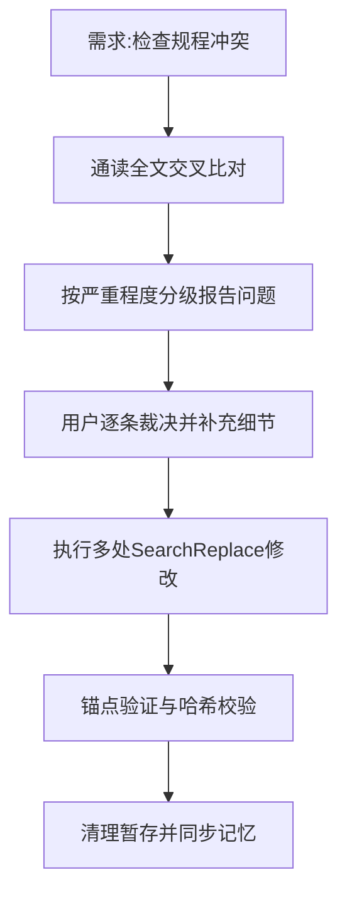

## 任务描述
审查并重构《革命协作协议》规则文件，解决模块间的实质冲突与表述含糊，并根据用户裁决建立新的四层授权体系。

## 执行过程

## 任务总结
1. **建立四层授权体系**：
   - 第一层：短时任务·逐项裁决。
   - 第二层：长任务·重大问题报告（用户在场，重大裁决逐个汇报）。
   - 第三层：长任务·危险操作报告授权（不在规划内的部署/删除等危险操作不做，先做其他，统一汇报）。
   - 第四层：完全执行（Agent允许的操作直接决定，可违背具体规定择优，但禁改规划文本和基本路线）。
2. **关键边界澄清**：
   - 第三/四层不得利用参谋程序反对规划，除非用户在场且先问。
   - “以实践为准”不等于盲动，需遵守程度规则（小的直接改，大的报告）。
   - 统一汇报按“大会”记录。
3. **技术执行要点**：使用锚点验证确保长文档修改准确性，通过哈希校验保证文件一致性。
