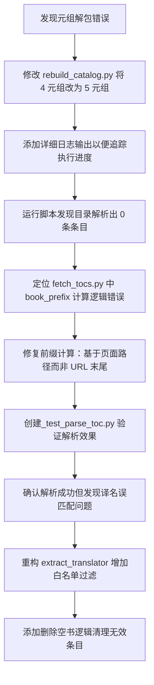

## 任务描述
修复马克思文集爬虫脚本中的元组解包错误、目录解析逻辑缺陷及数据清洗问题，确保脚本能正确抓取目录条目并生成干净的书目。

## 执行过程

## 任务总结
成功修复 rebuild_catalog.py 的元组解包错误，修正 fetch_tocs.py 的目录页解析逻辑（解决 index.htm 被误判为目录前缀的问题），优化译名提取规则过滤垃圾文本，并增加自动删除空书功能。最终脚本可正确抓取 166 本书籍的目录条目并生成规范书目。
